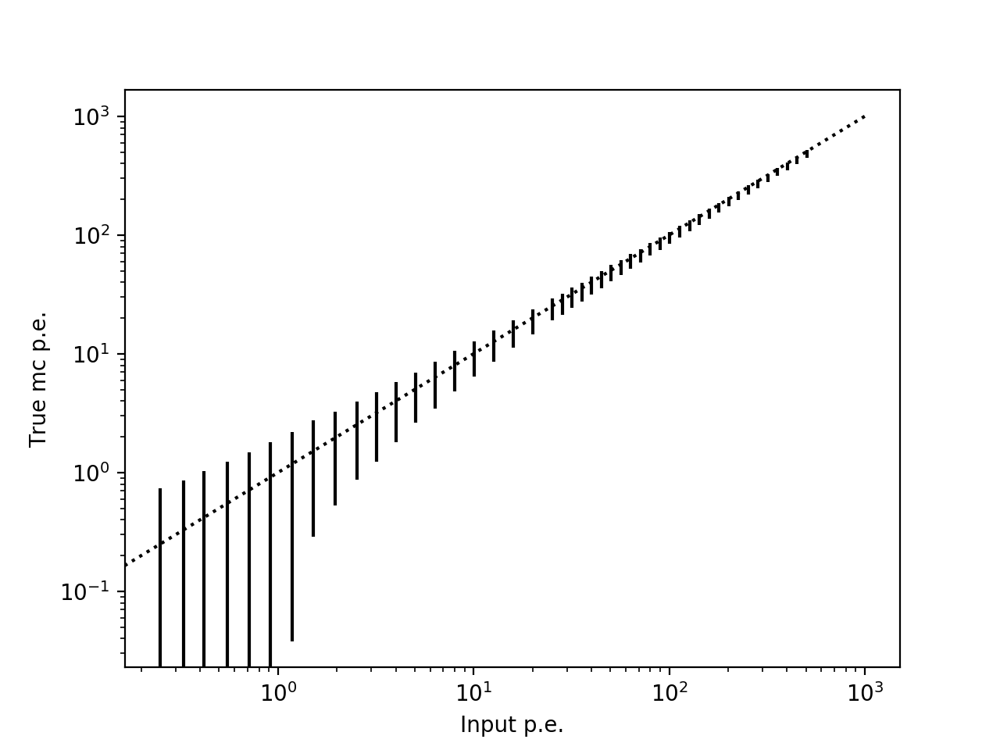
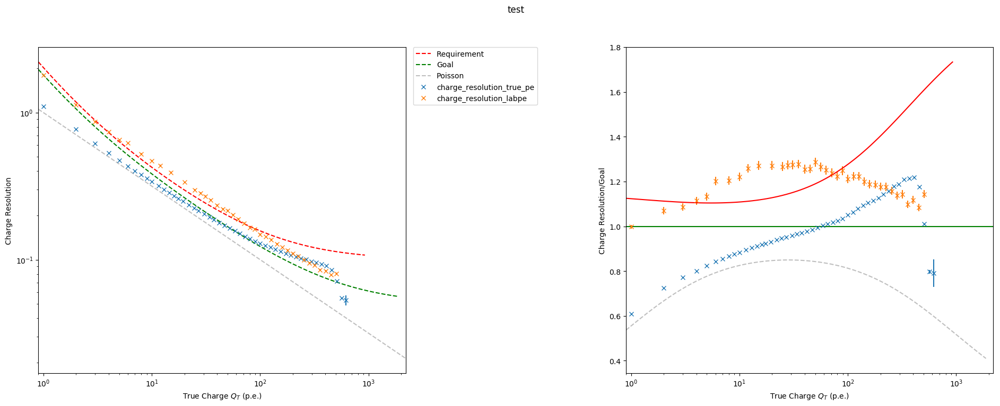

# MCValidation
Files:
get_photons.py reads in a run list and provides the required number of photons emitted in LightEmission package to obtain the desired p.e. level

run_simtel.py - just a script that runs the light emission package and sim_telarray. Also can generate a pixel mask file

example run:

python run_simtel.py --infile runlist.txt --outdir ~/Data/test_run --nevents 1 --runLightEmission --angdist ./angular_distribution.dat
--distance 100 --camradius 30 --runSimTelarray --nsb 0 --discthresh 0

exctract_charge_resolution.py 

python extract_charge_resolution.py --input_path ./d2018-02-09_DynRange_NSB0_mc --max_events 10 -o ./charge_resolution_test.h5 --calibrator HESSIOR1Calibrator -T 1 --plot_cam False --use_true_pe True

result can be plotted using 

python .../ctapipe/ctapipe/tools/plot_charge_resolution.py -f="['./charge_resolution_true_pe.h5', './charge_resolution_labpe.h5']"  -O ./comp_charge_res.png

